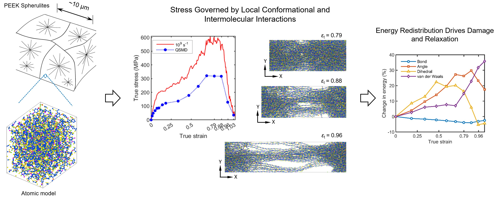

# Atomistic Models of Amorphous PEEK for LAMMPS (ReaxFF & PCFF)

This repository provides LAMMPS input scripts and data files for atomistic modeling of amorphous polyether ether ketone (PEEK) using ReaxFF and PCFF force fields, which were used in our recent journal paper: https://doi.org/10.1016/j.polymer.2026.130099.

The models are designed for molecular dynamics (MD) simulations of polymer deformation, damage evolution, and failure mechanisms at the nanoscale. The graphical abstract is shown below.

  

## 📦 Contents

- `ReaxFF/` – LAMMPS input files and data files for ReaxFF simulations  
- `PCFF/` – LAMMPS input files and data files for PCFF simulations  

